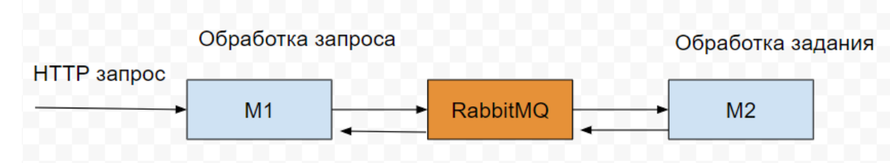

## Dependencies

- Docker
- Docker Compose
- Curl
- Typescript

## Ports
- 3001
- 15672
- 5672


## Installation

```bash
$ npm install

$ npm run build

$ docker-compose up -d 
```

## Running the app

```bash
$ npm run m1

$ npm run m2
```

## Test

```bash
#operation: "plus" | "munis" | "div" | "mult"
curl -X POST -d '{"operation": "plus","numbers": [1,2]}' -H "Content-Type: application/json" http://localhost:3001/runTask
```

